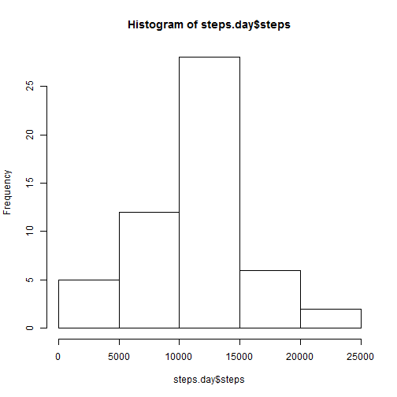
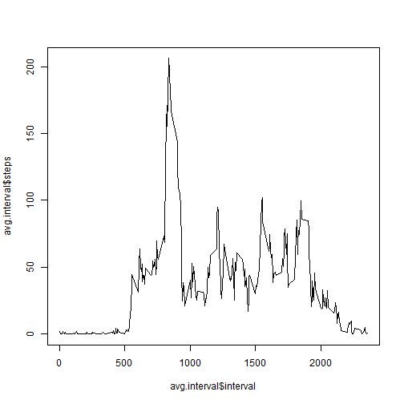
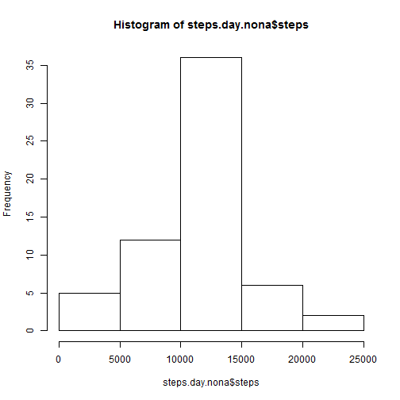
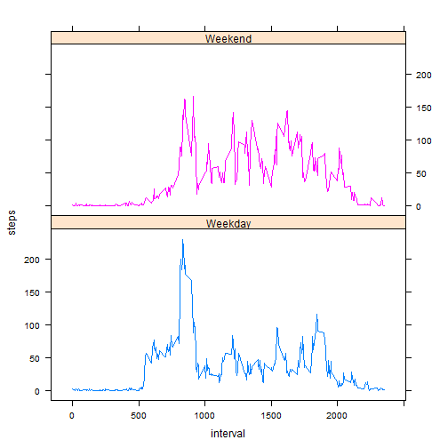

---
output:
html_document:
keep_md: yes
---
# Reproducible Research: Peer Assessment 1


## Loading and preprocessing the data


```r
# Read in data
activity <- read.csv("activity.csv", stringsAsFactors=F)

# Transform data column to date
activity$date <- as.Date(activity$date)
```

## What is mean total number of steps taken per day?


```r
steps.day <- aggregate(steps ~ date, data=activity, sum )
hist(steps.day$steps)
```

 

```r
mean.steps <- mean(steps.day$steps)

median.steps <- median(steps.day$steps)
```

The mean number of steps taken each day was: 1.0766 &times; 10<sup>4</sup>     
The median number of steps taken each day was: 10765


## What is the average daily activity pattern?

```r
avg.interval <- aggregate(steps ~ interval, activity, mean)
plot( avg.interval$interval, avg.interval$steps, type='l')
```

 

```r
max.steps <- avg.interval[which.max(avg.interval$steps),]

max.int <- max.steps$interval
```
The interval with the maximum number of steps, on average, is interval #835, with 206.1698 steps taken.


## Imputing missing values

```r
nr.na <- sum(is.na(activity$steps))
```

There are 2304 NA values in the dataset


```r
# Create new dataset and replace NA values with average steps for the interval

activity.nona <- activity
for ( row in seq_along(activity.nona[,1]) )
  {
  if ( is.na(activity.nona$steps[row]) )
    {
    activity.nona$steps[row] <- avg.interval[which(avg.interval$interval == activity.nona$interval[row]), "steps"]
    }
  }

steps.day.nona <- aggregate(steps ~ date, data=activity.nona, sum )
hist(steps.day.nona$steps)
```

 

```r
mean.steps.nona <- mean(steps.day.nona$steps)

median.steps.nona <- median(steps.day.nona$steps)
```

The mean number of steps taken each day with NA values replaced was: 1.0766 &times; 10<sup>4</sup>     
The median number of steps taken each day with NA values replaces was: 1.0766 &times; 10<sup>4</sup>

Both values hasn't changed much (the median changed slightly), as we've replaced NA with the means for each value. 

## Are there differences in activity patterns between weekdays and weekends?

```r
library(lattice)
weekdays <- weekdays(as.Date("2014-07-14")+0:4)

for ( i in seq_along(activity.nona[, 1]) )
  {
    if ( weekdays(activity.nona$date[i]) %in% weekdays ) 
         {
            activity.nona$day[i] <- "Weekday"
         } else {
            activity.nona$day[i] <- "Weekend"
         }
  }
steps.int.day <- aggregate(steps ~ interval + day, data=activity.nona, mean )
xyplot(steps ~ interval|day, data=steps.int.day, type='l', groups = day, layout = c(1,2))
```

 
